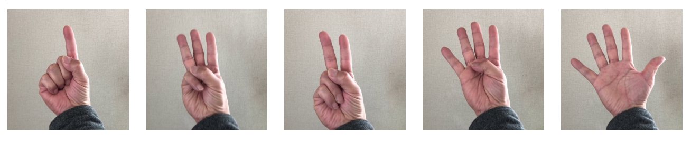

MobileNetの転移学習で気をつけたい6つのポイント

# はじめに
MobileNetの転移学習で、画像を5つのクラスに分類するモデルを構築した際に気づいたポイントを6つシェアします。MobileNetは、その名前が表す通りスマホなどコンピューター資源の乏しい環境下でも快適に推論が動作するように作られたモデルです。ResNet50およびVGG16も同時に試しましたが、その他モデルのサイズが100MBを超えるなかMobileNetは約15MBと非常に小さく、また推論にかかる時間もVGG16の1/4、ResNetの1/2とかなり高速で正答率もその他の重厚なモデルに比べて遜色ないという性能を表しました。

今回、ビデオから切り出した画像データを追加でトレーニングさせ、以下のようなポイントに気をつけながらすでに構築されている高性能なモデルを流用し、短期間で高精度な性能を確保することができました。

1. ビデオから正解ラベルとトレーニングデータ両方を自動的に作成する
1. 既存モデルに追加する独自出力層はモデルの用途と特性を考慮する
1. 既存モデルのBatch Normarization層はトレーニング対象にする
1. Kerasの便利な水増し機能を使ってトレーニング画像を増やす
1. 最終エポックで出力されるモデルが最強とは限らない
1. みんな大好きiOSデバイスで使えるようにCoreMLに変換する

トレーニングデータの作成からモデルの生成までを極力人手を介さずに実行できるように考慮したつもりです。極論すると、入り口のムービーファイルを用意し、出口のクラスファイルを作成するだけでMobileNetをベースとした独自モデルを簡単に構築することができます。ちなみにトレーニングにかかる時間は、220枚のトレーニング用イメージと71枚の検証用イメージを5クラスに分類するモデルで、Late2014という5年前のMacBook Pro（8GBメモリー）を利用して、100エポック回すのに185分かかりました。

今後エッジ側での推論はますます重要な地位を占めるようになると思いますので、本記事がこれからエッジ上でComputer Visionのタスクを実装する方々の参考になれば幸いです。

## インストールしておくべきライブラリ

本記事で対象とするバージョンは以下に限定しています。coremltoolsはKerasとTensorflowのバージョンに著しく依存していますので必ず以下のバージョンの組み合わせでセットアップしてください。

Python: 3.6.7
coremltools: 2.0
Keras: 2.1.6
Tensorflow: 1.5.0
OpenCV: 3.4.4.19
Plot: 3.0.2

以下のコマンドで、バージョンを指定して必要なライブラリをインストールします。(Jupyterはバージョンを指定せずインストールして構いません)

```bash
$ pip install coremltools==2.0
$ pip install keras==2.1.6
$ pip install tensorflow==1.5.0
$ pip install numpy==1.15.4
$ pip install opencv-python==3.4.4.19
$ pip install matplotlib==3.0.2
$ pip install pillow==5.4.0
$ pip install jupyter
```

# ビデオから静止画を自動的に切り出し
トレーニング用データとして静止画を新たに撮影しサイズ調整などを手作業で行うことは苦痛を伴う作業です。実際に業務で使うとなるとWebからスクレイピングで拾ってこようにも適切なイメージが存在しなかったり。さらに撮影した画像に正解ラベルをつけていかなくてはならないと思うと気が遠くなります。そこで、今回はiPhoneのClipsというApple純正アプリで撮影した正方形のムービーから、指定された切り出し頻度ごと（何フレームごとに切り出すか）に静止画を抽出することにします。

## ムービーの撮影と事前準備
切り出し処理の前に手作業で以下を実施し素材ムービーを準備します。この時一つ一つのムービーにつけられたファイル名が正解ラベルになりますので命名には十分配慮してください。今回は、指が何本立っているかと言うハンドサインを1から5まで撮影しました。



## ポイント1：静止画の切り出しとアノテーションの自動化
OpenCVを利用してビデオから静止画を抽出し、正解ラベル毎のディレクトリに抽出した静止画を書き込みます。例えば"deep_learning.mov"というファイルから抽出されたイメージは"../dataset/training/deep_learning"というディレクトリに、0から始まる連番で"0.jpg"のようにファイル名がつけられて保存されます。なお、ビデオファイルのフレームレートは約30fpsですから、4フレームごとに静止画を抜き出す設定であれば1秒あたり7枚の静止画が抜き出されることになります。

```python
# Loop until the end of the file list under the movie directory.
file_list = [f for f in os.listdir(movie_path) if os.path.isfile(os.path.join(movie_path, f)) and  f.endswith(".mov")]
for filename in file_list:
    source_file = os.path.join(movie_path, filename)
    destination_dir = os.path.join(train_data_dir, os.path.splitext(filename)[0])
    
    # Make destination directory if not exist
    if not os.path.exists(destination_dir):
        os.mkdir(destination_dir)

    # Open video file to capture the jpeg images
    capture = cv2.VideoCapture(source_file)

    img_count = 0
    frame_count = 0

    # Loop until  EOF
    while(capture.isOpened()):
        
        # Read one video frame
        ret, frame = capture.read()
        if ret == False:
            break

        # Pick up the frame if its position is the specified frame interval
        if frame_count % frame_interval == 0:
            img_file_name = os.path.join(destination_dir, str(img_count) + '.jpg')
            cv2.imwrite(img_file_name, frame)
            img_count += 1
        frame_count += 1
    # Close the current movie file
    capture.release()
    print('# of images & path:', img_count, 'images under' + destination_dir)
```

## 切り出し後の処理
ムービーから静止画の切り出しが終ったら、切り出された画像の中に不適切な切り出し方をされたものがないか目視でチェックします。例えば、大きく手ブレしているもの、一部分しか写り込んでいないものなどトレーニング、検証、テストに用いるには不適切と思われるデータを手作業で削除します。

# モデルの構成

既存のモデルを流用する転移学習では、一番最上位の出力レイヤーは使用せず独自の出力レイヤーに入れ替えます。この最終出力レイヤーをどのような構成にするかという点もチューニングのポイントになります。

## ポイント2：用途に応じた独自アウトプットレイヤーの構築

流用モデルの生成で、``include_top=False`` を指定したので、自分の望むクラスに分類されるよう独自レイヤーを作成します。ここでは、流用モデルの最終アウトプット部分に独自の追加レイヤーを連結してのぞみの結果をアウトプットできるように改造します。

```python
input_tensor = Input(shape=(224, 224, 3))
base_model = MobileNet(include_top=False, weights='imagenet', input_tensor=input_tensor) 

# Make our own output layers
x = base_model.output
# Flatten layer is not suitable for MobileNet based model as it makes file size larger
# x = Flatten(input_shape=base_model.output_shape[1:])(x)
x = GlobalAveragePooling2D()(x)
x = Dense(256, activation='relu', name='fc1')(x)
x = BatchNormalization()(x)
x = Dropout(0.5)(x)
output_tensor = Dense(len(class_labels), activation='softmax', name='predictions')(x)

# Connect base model to our own output layers
mymodel = Model(inputs=base_model.input, outputs=output_tensor)
```

ResNet50やVGG16のような大きなニューラルネットワークモデルでは、最終アウトプット部分への入力にFlattenを使用することが多いようですが、軽量なネットワークである特性を生かしたいMobileNetではGlobalAveragePooling2Dを使用します。

MobileNetにFlattenを利用することも可能ですが、その場合次のDenseレイヤーに渡されるデータが ``7 ｘ 7 ｘ 1024 = 50176`` と大きくなり、結果として出来上がったモデルのサイズも約115MBとGlobalAveragePooling2Dを利用した場合の約15MBに比べて100MBも大きくなってしまいます。これでは、若干精度を犠牲にした軽量・高速なモデルという特性が台無しになってしまうので、MobileNetではGlobalAveragePooling2Dを使用します。

ちなみに、最終アウトプット部分への入力サイスを比較してみると、ResNet50が ``1 ｘ 1 ｘ 2048 = 2048`` でVGG16が ``7 ｘ 7 ｘ 512 = 25088`` であり、MobileNetにFlattenを適用すると、ResNet50の25倍、VGG16の2倍という巨大なデータを最終アウトプット部分への入り口で受け取ってしまい、軽量・高速という特性が台無しになってしまうことがわかります。

## ポイント3：元のモデルが持つBatch Normarization Layerはトレーニング対象にする

今回、元のパラメーターはトレーニング対象としないつもりでしたが、それだとトレーニング時のロスが収束せず精度が出なかったたため、途中から流用元モデルのが持つウェイトの一部を更新するようにしました。

ResNet50とMobileNetは内部にBatch Normalization層という特別なレイヤーを持っており、ここで次のレイヤーに渡す入力データをバッチ単位で正規化することで過学習を抑制しています。この層に対して「ウェイトのアップデートを行わない」と指定すると再計算がおこなわれず、元々もっていた値がそのまま使用され、最終的なアウトプットの精度が著しく悪化します。そのため、流用元モデルのレイヤーからBatch Normalization層を特定し、このレイヤーだけは再トレーニングの対象とし再計算させます。また、追加した独自のアウトプットレイヤーは全てトレーニングの対象とします。

ディープラーニングにおける学習とは、ネットワーク構造の中に持っているパラメーターの重み（ウェイト）を学習したデータに合わせて更新することです。構造だけを流用して、このウェイトを一から学習するということは、VGG16やResNetで持っている2,500万近いパラメーター、MobileNetで持っている350万程度のパラメーターを全て一から計算し直すということですから、もしGPUを利用したとしても相応の時間がかかりますし、学習のためのデータも数十万のオーダーで大量に必要になります。

そこで、全てのパラメーターを更新するのではなく、必要と思われる部分だけを更新することで時間と必要データの削減を行う方法がよく利用されています。一般的には、流用元モデルがすでに持っているウェイトは一切更新せず、新たに独自に付け加えた最終レイヤのみをトレーニング対象にするという方法がとられます。

この方法は転移学習と呼ばれ、元のモデルが持つ構造とウェイトをそのまま流用して特徴検出器としての役割を持たせる方法です。一方、元のモデルの構造は流用するがウェイトは検出したいクラスに合わせてアップデートする方法はファインチューニングと呼ばれます。

構築したモデルは、``my_model.summary()`` によってそのレイヤー構成をプリントすることができます。

```python
# Set the trainable flag to true if the layer is batch normalization layer.
freeze_layer_counts = 0
for layer in mymodel.layers[:len(base_model.layers)]:

    # MobileNet need to update its batch nomalization layer to converge the loss.
    if layer.name.endswith('_bn'):
        # You can understand the training loss never converge when you set this to false.
        layer.trainable = True
    else:
        freeze_layer_counts = freeze_layer_counts + 1
        layer.trainable = False

# I need to update the paraemters for my additional layers.
for layer in mymodel.layers[len(base_model.layers):]:
    layer.trainable = True

print('Model Structure:')
mymodel.summary()
print('Total Layers:  ' + str(len(mymodel.layers)))
print('Freezed Layers:' + str(freeze_layer_counts))
```

# トレーニングとモデルの変換

## ポイント4：オーバーフィッティングを抑制するためにトレーニング画像を水増しする

イメージデータは、トレーニング用、検証用に最低限2種類が必要です。今回の記事では、ビデオから切り出した画像はあくまでもトレーニングディレクトリにあるものだけで、検証用のデータセットを別に切り出してはおらず、トレーニング用データセットの25%を自動的に割り当ててもらようKerasに設定します。また、それら画像の読み込みは、Kerasのジェネレーターを介して行われます。ジェネレーターは、元の画像データに手を加えてトレーニングデータを水増しするという便利な機能を持っているため利用しています。本記事では元画像に対して以下のような加工を行いトレーニング時にオンメモリーで画像の水増しを行なっています。

1. 上下へ20％ランダムにズラした画像を追加
1. 左右へ20％ランダムにズラした画像を追加
1. 30％の範囲内でランダムにズーム
1. 最大45度の範囲でランダムに回転
1. RGBのチャネルを50％の範囲内でランダムにシフト
1. 10〜90％の範囲でランダムに明るさを変更

ジェネレーターには、他にも上下左右反転などの機能を持っていますが今回は使用していません。じゃんけん判定器などを作成するのならば、上下反転（自分から見た絵と相手から見た絵）や左右反転（右利きの絵と左利きの絵）もかなり利用価値があるかもしれません。 ``rescale=1.0/255`` のパラメーターは、RGB値（255:255:255）を0から1までの値にスケール合わせするために使用しています。ディープラーニングに限らず、機械学習の中ではスケールの異なるフィーチャーを同一スケールに合わせるという技法がよく使われます。

```python
train_data_generator = ImageDataGenerator(
    rescale=1.0/255.0,
    rotation_range=45,
    zoom_range=0.3,
    brightness_range=[0.1, 0.9],
    channel_shift_range=50.0,
    width_shift_range=0.2,
    height_shift_range=0.2,
    validation_split=validation_data_split_rate)

train_generator = train_data_generator.flow_from_directory(
    train_data_dir,
    target_size=(224, 224),
    color_mode='rgb',
    classes=class_labels,
    class_mode='categorical',
    batch_size=batch_size,
    subset='training',
    shuffle=True)

validation_generator = train_data_generator.flow_from_directory(
    train_data_dir,
    target_size=(224, 224),
    color_mode='rgb',
    classes=class_labels,
    class_mode='categorical',
    batch_size=batch_size,
    subset='validation',
    shuffle=True)
```

## ポイント5：トレーニング中にベストを更新したモデルを保存する

作成したモデルをコンパイルし、該当モデルにトレーニングデータを投入します。このとき、200枚の画像をバッチ枚数64枚でトレーニングするならば、1回のエポックでは200 ÷ 64 = 4 ステップが実行されることになります。これを50〜100エポック程度繰り返してモデルのトレーニングを行います。この時、以下のような学習曲線が描かれて徐々にモデルの誤差が減少していき精度が高まってきます。この学習曲線はトレーニングのロスに-1をかけて、トレーニングと検証両者のロスがゼロに向かって収束するように見せかける細工がしてあります。


ちなみに、細工をしてないグラブはこちらです。


トレーニングデータでの誤差（正解との差異）と検証データでの誤差の両方が徐々にゼロに近づいていき、両者のグラフがゼロに向かって収束していけばトレーニングが順調に進んでいることを表します。トレーニングデータの量にもよるようですが、多くの学習曲線はこのように最初の10エポックあたりで劇的に誤差が下がり、以降は緩やかに誤差が減少しています。ですから、チューニングを試行錯誤している段階でトレーニングがうまく進んでいるかどうかをみるためであれば、最初の10エポック程度を回してみればその良し悪しの判別がつ区のではないでしょうか。なお、本記事のデータ量とモデルでは、1エポックの実行に要する時間は100秒前後ですのでトレーニング時間の目安にしてください。

モデルは最後のエポックが終わった時に出来上がったものが一番性能がいいとは限りません。往々にして途中に性能のいいモデルがあり、最後にできあがったモデルは2番目や3番目ということもありえます。そこで、ModelCheckpointというコールバック関数を定義して、各エポックが終了した時点でトレーニングデータの誤差がベストだった場合にのみ、その時点のモデルを保存するようにしています。

その他にも誤差が拡大したらその時点で以降のエポックを実施せず強制終了するEarlyStoppingというコールバック関数もありますが、一旦誤差が拡大した後再び収束に向かうケースも多々ありますので、こちらの関数は試してみたものの利用しないこととしました。

トレーニングの結果は、エポックごとにトレーニングデータでの誤差と精度、検証データでの誤差と精度で表されます。本記事ではトレーニング終了後にこれらの情報をテキストファイルに落としてトレーニングの進捗状況として学習曲線の描画などに利用しています。

```python
print('Start training:')

# Compile the model
mymodel.compile(loss='categorical_crossentropy', optimizer=optimizers.SGD(
    lr=1e-3, momentum=0.9), metrics=['accuracy'])

# Save the model if it has the best loss after an epoch training.
checkpoint_cb = ModelCheckpoint(filepath=os.path.join(result_dir, 'mobilenet.h5'),
                                monitor='loss',
                                verbose=1,
                                save_best_only=True,
                                save_weights_only=False,
                                mode='auto',
                                period=1)

# Stop earlier when the training has stopped improving val_loss. 
# earystop_cb = EarlyStopping(monitor='val_loss',
#                                 patience=0,
#                                 verbose=1,
#                                 mode='auto')

# Transfer learning start
start = time.time()
history = mymodel.fit_generator(
    train_generator,
    steps_per_epoch=math.ceil(train_generator.samples / batch_size),
    epochs=epoch_count,
    callbacks=[checkpoint_cb],
    validation_data = validation_generator,
    validation_steps=math.ceil(validation_generator.samples / batch_size))

# End learning
process_time = (time.time() - start) / 60
print('Learning Time: ', '{:.2f}'.format(process_time), 'min.')
```

## ポイント6：AndroidだけではなくiOSでも利用できるようにモデルを変換

出来上がったモデルをクラウド上に置いて、REST APIでリモートから叩けるようにするのも良いですが、最近のトレンドはエッジ側での推論でありスマホは誰もが持っている代表的なエッジデバイスですから誰もがスマホアプリとしてリリースを考え流でしょう。しかしせっかくマルチプラットフォームなアプリを用意しても、せっかく作ったモデルがAndroidでしか使えないとなると、何やってんの弾幕薄いよ！と怒られてしまいます。

ですから、トレーニング完了後は、できあがったモデルをcoremltoolsを利用してCoreML用に変換しiOSデバイスでも利用できるようにします。ところが、MobileNetのモデルをただ単にKerasで読み込もうとすると ``Unknown activation function:relu6`` というエラーが発生します。これはKeras自体に該当するファンクションが実装されていないためであり、このファンクションにはmobilenet.relu6を使用するという独自スコープをCustomObjectScope関数で与えることにより解決できます。

```python
# You will get "ValueError: Unknown activation function:relu6" if you did not set the following first line of code.
with CustomObjectScope({'relu6': mobilenet.relu6, 'DepthwiseConv2D': mobilenet.DepthwiseConv2D}):
    my_coreml_model = coremltools.converters.keras.convert(os.path.join(result_dir, 'mobilenet.h5'),
        is_bgr=False,
        image_scale=1.0/255,
        input_names='image',
        image_input_names='image',
        class_labels=class_labels)
    my_coreml_model.save(os.path.join(result_dir, 'mobilenet.mlmodel'))
```

# おわりに

ここで構築したモデルは、CoreMLを利用したiPhone用のサンプルコードにほぼそのまま持っていけます。ここにあるコードはこちらのGitHubから入手できますので、是非みなさんもMobileNetの実力を試してみてください。

